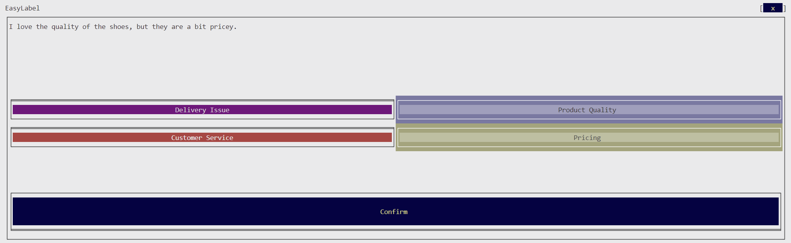

# EasyLabel

Easy-to-use data labelling tool for machine learning models.

# Table of Contents

- [EasyLabel](#easylabel)
- [Table of Contents](#table-of-contents)
- [Overview](#overview)
- [Technologies](#technologies)
- [Getting Started](#getting-started)

# Overview

Often times, we need to label data for machine learning models. This repo takes inspiration from my job as a cashier, where the buttons on the register are color-coded and in the same position. Mirroring this, we create an enviornment where labelling data is as easy as pressing a button.



# Technologies

This project is created with:

- [Py Term Tk](https://github.com/ceccopierangiolieugenio/pyTermTk)
- [Pandas](https://pandas.pydata.org/)
  
# Getting Started

To get started, you will need to install the dependencies. This project uses [Poetry](https://python-poetry.org/) to install and manage a project specific venv.

Clone the Repo \
```git clone https://github.com/Pop101/EasyLabel``` \
Enter the repo and install requirements \
```cd EasyLabel && poetry lock```

Modify the config to point to any data you want to label. \
```nano config.yaml```

Run the script to interactively begin labeling, progress will resume if you decide to take a break. \
```poetry run python easy_label.py```
